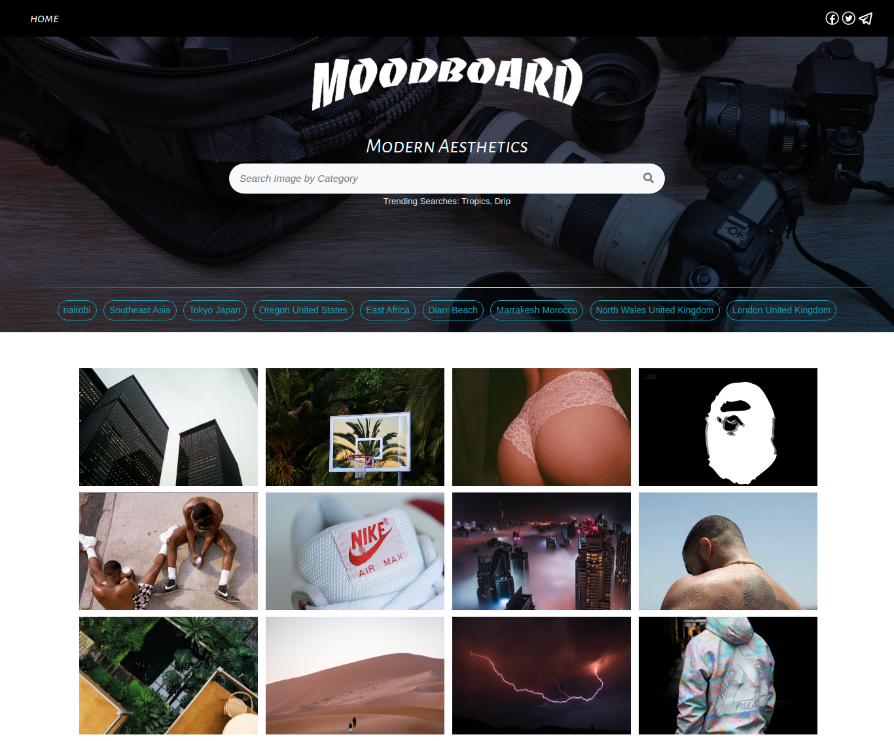
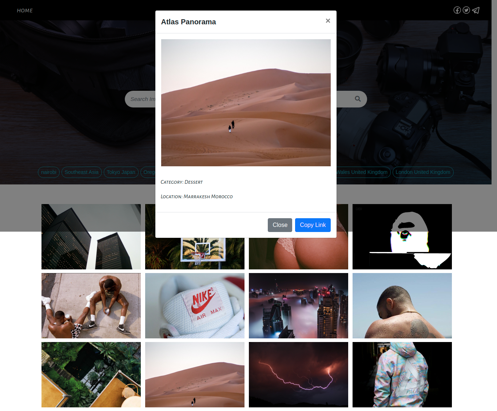

### Author
 **[Isaac Gichuru.](https://github.com/Isaacg94) 26/10/2019.**

## Description

Moodboard is a photo gallery web application to showcase millenial focused pictures. Users get can view photos uploaded by admin. Users can see photos based on the location, by clicking on the listed locations in the menu. They can also copy the link to a photo to paste at their discretion. They can also search for photos based on the categories.

## Features
* A landing page that allows users to see various images.
* A display of images based on the location once a location is clicked on.
* A modal displaying image details once an image is clicked on.
* Users can also search for images based on categories.
* A navigation bar with a link to navigate back to the landing page.
* Admin capabilities to upload images through the dashboard.

**[Live-Link to site.](https://world-news-highlights.herokuapp.com/)**

# Specifications

## BDD
| Behavior            | Input                         | Output                        |
| ------------------- | ----------------------------- | ----------------------------- |
| View photos of interest | Scroll to see a gallery and click on picture | Displays a picture with name description and copy link for sharing |
| Search a picture by category | Enter the category in the search input| Displays photographs in the searched category |
| View pictures by location | Click on location of interest in menu bar | Displays photographs of chosen location |
| Copy Link to clipboard | Click on copy link button in the modal class | Copies link to clipboard |
| View Single picture | Click on photo of interest then click on image | Displays a single page with details of the picture |

## Setup/Installation Requirements
Here is a run through of how to set up the application:
* Step 1 : Clone this repository using the git clone link:
  * **`git clone https://github.com/Isaacg94/Gallery.git`**
* Step 2 : Navigate to the directory:
  * **`cd Gallery-master`**
* Step 3 : Open the directory created with your favorite IDE. If Atom type **`atom .`** if VSCode type **`code .`** . This will lauch the editor with the project setup,
* Now feel free to hack around the project.

## Known Bugs
* None currently.

## Technologies Used

- Python 3.6.8
- Django MVC framework
- HTML, CSS and Bootstrap
- Postgressql
- Heroku

## Support and contact details

Primary E-mail Address: 7248zack@gmail.com

### License
*MIT License* 

Copyright (c) 2019 **Isaac Gichuru**